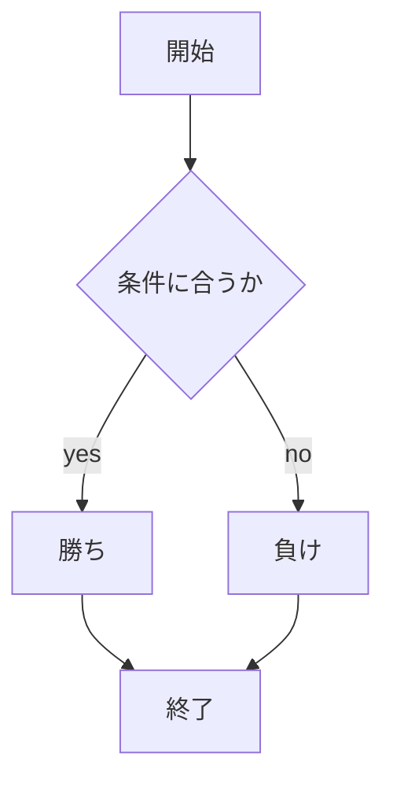

# webpro_06
ファイル名 | 説明
-|-
app5.js | プログラム本体
public/janken.html | じゃんけんの開始画面
views/janken.ejs | じゃんけんのテンプレートファイル

```javascript
console.log( 'Hello' );
```

1. ```app5.js``` を起動する
1. Webブラウザでlocalhost:8080/public/janken.htmlにアクセスする
1. 自分の手を入力する

##　このプログラムについて

このプログラムは、Node.jsのExpressフレームワークを使った簡単なウェブアプリケーション。

## 基本設定
- `express`モジュールを使用してサーバーを作成し、EJSをテンプレートエンジンとして設定している。
- `/public`フォルダを静的ファイルの提供ディレクトリとして指定しているため、画像やCSSなどのファイルをこのフォルダ内に配置が可能。

## ルーティング
- **`/hello1` と `/hello2`**：`show`というテンプレートを使って、異なる挨拶メッセージ (`greet1`と`greet2`) を表示。
- **`/icon`**：Appleロゴ画像を表示するためのページです。`filename`に画像ファイルのパス、`alt`に画像の代替テキストを設定。
- **`/luck`**：1から6までの乱数を生成し、ランダムなおみくじ結果を表示します。1は「大吉」、2は「中吉」とし、それ以外はログに出力しない。
- **`/janken`**：じゃんけんの結果を表示するページ。
  - ユーザーが選んだ手 (`hand`)、勝利数 (`win`)、総試合数 (`total`) を取得し、コンピューターの手をランダムで決定。
  - 勝敗を判定し、その結果を `judgement` に設定。
  - 結果は `janken` テンプレートに表示され、勝利数と総試合数も表示。

## サーバーの起動
- サーバーはポート8080でリクエストを待機。コンソールには「Example app listening on port 8080!」と表示される。

各ルートで異なるHTMLテンプレートをレンダリングし、動的な内容をクライアントに提供する構造になっている。

## ファイル一覧

